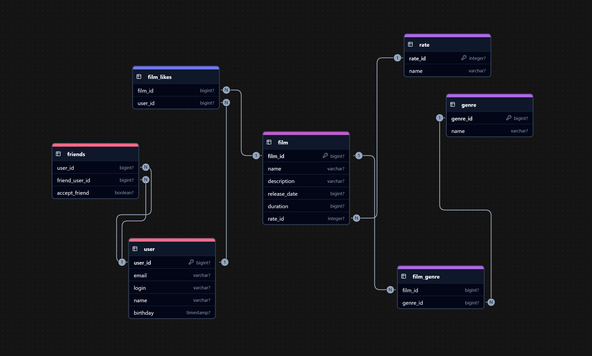

# java-filmorate
Template repository for Filmorate project.

Схема базы данных

Примеры запросов: 

Выведет список всех фильмов (название и описание) вместе с их рейтингом.
SELECT f.name,
       r.name
FROM film AS f
LEFT JOIN rate AS r ON f.rate_id=r.rate_id;

Выведет список всех пользователей (имя и email), у которых есть хотя бы один подтвержденный друг.
SELECT u.name,
       u.email
FROM user AS u
JOIN friends AS f ON u.user_id=f.user_id
WHERE f.accept_friend = TRUE;

Выведет список всех фильмов (название и год выпуска), которые относятся к жанру "Комедия".
SELECT f.name,
       f.release_date
FROM film AS f
JOIN film_genre AS fg ON f.film_id=fg.film_id
JOIN genre AS g ON fg.genre_id=g.genre_id
WHERE LOWER(g.name) = 'comedy';

Выведет список всех пользователей (имя и email), которые лайкнули хотя бы один фильм.
SELECT u.name,
       u.email
FROM user AS u
JOIN film_likes AS fl ON u.user_id=fl.user_id;
