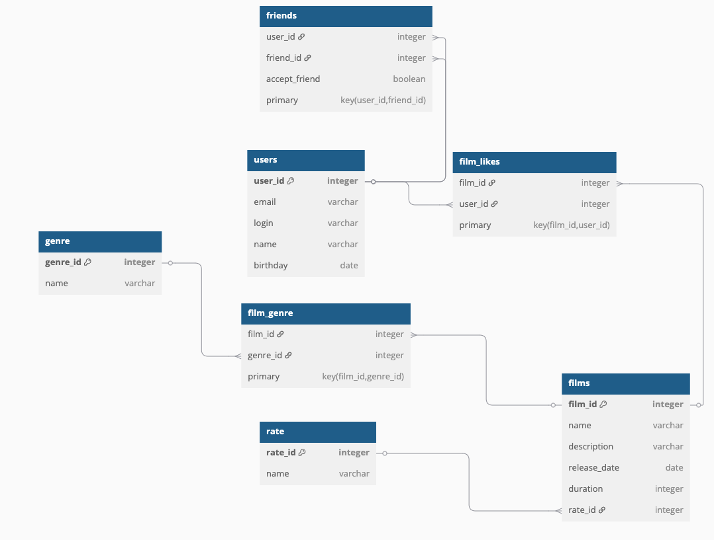

# java-filmorate
Template repository for Filmorate project.

Схема базы данных

Примеры запросов:

Получить все фильмы с их рейтингами MPA

SELECT f.name AS film_name,
       f.description,
       r.name AS mpa_rating
FROM films AS f
LEFT JOIN rate AS r ON f.rate_id = r.rate_id; 

Получить пользователей с подтвержденными друзьями

SELECT u.name AS user_name,
       u.email
FROM users AS u
JOIN friends AS f ON u.user_id = f.user_id
WHERE f.accept_friend = TRUE;

Получить комедии с годом выпуска

SELECT f.name AS film_name,
       EXTRACT(YEAR FROM f.release_date) AS release_year
FROM films AS f
JOIN film_genre AS fg ON f.film_id = fg.film_id
WHERE fg.genre_id = 1;  -- 1 = Комедия

Получить пользователей, поставивших лайки

SELECT DISTINCT u.name AS user_name,
       u.email
FROM users AS u
JOIN film_likes AS fl ON u.user_id = fl.user_id; 

ТОП-10 популярных фильмов

SELECT f.name AS film_name,
       COUNT(fl.user_id) AS likes_count
FROM films AS f
LEFT JOIN film_likes AS fl ON f.film_id = fl.film_id
GROUP BY f.film_id, f.name
ORDER BY likes_count DESC
LIMIT 10;

Общие друзья двух пользователей

SELECT u.name AS common_friend_name,
       u.email
FROM users AS u
JOIN friends AS f1 ON u.user_id = f1.friend_id AND f1.user_id = 1
JOIN friends AS f2 ON u.user_id = f2.friend_id AND f2.user_id = 2
WHERE f1.accept_friend = TRUE AND f2.accept_friend = TRUE; 

Фильмы с жанрами

SELECT f.name AS film_name,
       STRING_AGG(g.name, ', ') AS genres
FROM films AS f
LEFT JOIN film_genre AS fg ON f.film_id = fg.film_id
LEFT JOIN genre AS g ON fg.genre_id = g.genre_id
GROUP BY f.film_id, f.name; 

Пользователи с количеством друзей

SELECT u.name AS user_name,
       COUNT(f.friend_id) AS friends_count
FROM users AS u
LEFT JOIN friends AS f ON u.user_id = f.user_id AND f.accept_friend = TRUE
GROUP BY u.user_id, u.name;